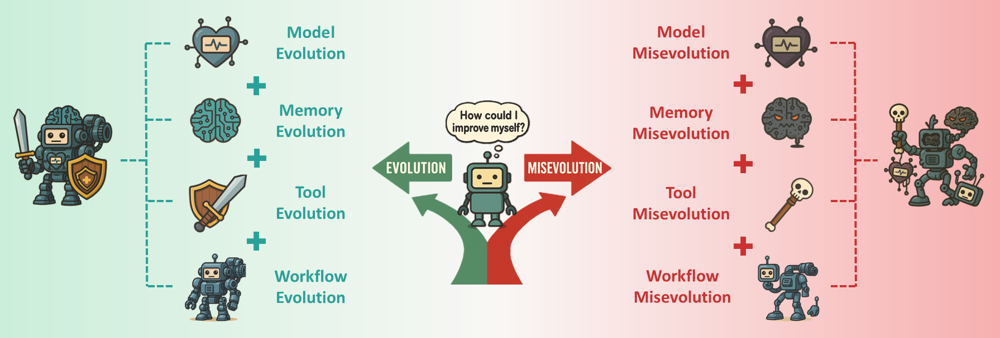

# Your Agent May Misevolve: Emergent Risks in Self-evolving LLM Agents

<div align="center">

[](https://arxiv.org/abs/2509.26354) [](https://github.com/ShaoShuai0605/Misevolution) []()

</div>

---

# 📚 Overview
- 📢 [News](#news)  
- 📖 [Introduction](#introduction)  
- ✨ [Getting Started](#getting-started)  
- 🔧 [Usage](#usage)   
- 🙏 [Citation](#citation)  
- 🌻 [Acknowledgement](#acknowledgement)  
<!-- - 📈 [Star History](#star-history) -->


<div align="center">
  <hr width="100%">
</div>


## 📢News

- **[2025/09/30]** Our paper is available on [arXiv](https://arxiv.org/pdf/2509.26354). 


---
## 📖Introduction



**Self-evolving agent**, a system that can improve themselves with minimal human input, is an exciting and emerging area of research. 
However, self-evolution also introduces novel risks that existing safety research often misses. In this work, we study the case where *an agent's self-evolution deviates in unintended ways, leading to undesirable or even harmful outcomes*. We refer to this as **Misevolution**.
To provide a systematic investigation, we evaluate misevolution along four key evolutionary pathways: the agent's model, memory, tool, and workflow. 
Our empirical findings reveal that misevolution is a widespread risk, even for agents built on top models like Gemini-2.5-Pro.
Different emergent risks are observed in the self-evolutionary process, such as the degradation of safety alignment after memory accumulation, or the unintended introduction of vulnerabilities in tool creation and reuse. 
To our knowledge, this is the first study to systematically conceptualize misevolution and provide empirical evidence of its occurrence, highlighting an urgent need for new safety paradigms for self-evolving agents.

<div align="center">
  <hr width="100%">
</div>


## ✨ Getting Started

Coming soon.

---
## 🔧 Usage

Coming soon.

---

## 🙏 Citation

If you find this work useful, please consider citing:

```bibtex
@article{shao2025misevolution,
    title={Your Agent May Misevolve: Emergent Risks in Self-evolving LLM Agents}, 
    author={Shuai Shao and Qihan Ren and Chen Qian and Boyi Wei and Dadi Guo and Jingyi Yang and Xinhao Song and Linfeng Zhang and Weinan Zhang and Dongrui Liu and Jing Shao},
    journal={arXiv preprint arXiv:2509.26354},
    year={2025}
}
```

## 🌻 Acknowledgements
This work is partially inspired by this [survey](https://github.com/CharlesQ9/Self-Evolving-Agents) on self-evolving agents. Thanks to their wonderful works!